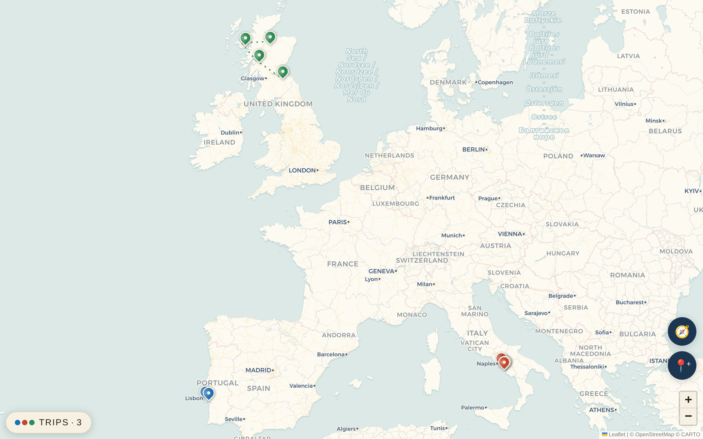
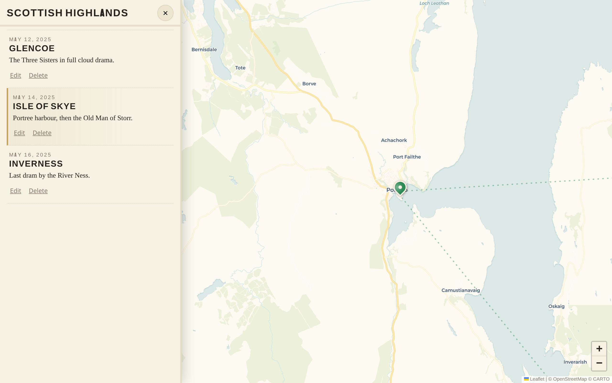

# Wanderstamp

A self-hosted family travel log, drawn as a vintage atlas. Every holiday is a
trip with its own colour; every place you visit is a pin on the map; every
trip becomes a **story** — scroll the chapters and the map flies from stop to
stop along a dotted ink route. Countries you've visited collect as stamps in
a shared family **passport**.

Pair it with [Immich](https://immich.app) and it does the filing for you:
while a holiday is live, the photos your phones auto-upload are clustered by
location into photo pins — small photo prints laid on the atlas. Photos never
leave Immich; Wanderstamp stores asset IDs and proxies thumbnails behind its
own login.



## Features

- **Live holidays** — start a holiday and every pin you drop (and every
  Immich photo) attaches to it until you end it; past trips can be added
  retroactively and their photos are pulled in automatically
- **Trip stories** — tap any pin and the trip opens as a scrollable story:
  one chapter per stop, in the order you were really there, with the map
  following your reading
- **Journey lines** — each trip's stops joined by a dotted route in the
  trip's colour
- **Passport stamps** — a page of rubber-stamp entries, one per country per
  trip
- **Journals, notes and cover photos** — the stories the photos don't tell
- **View-only share links** — hand a trip's story to grandparents or
  friends without accounts; revoke or replace the link any time
- **Multi-user** — accounts for the whole family, managed in-app
- **Small and boring to operate** — one static Go binary (stdlib HTTP +
  modernc SQLite) with an embedded vanilla-JS/Leaflet frontend, in a ~10 MB
  scratch container; no external dependencies required



## Quick start

```yaml
services:
  wanderstamp:
    image: ghcr.io/sinful1992/wanderstamp:latest
    ports:
      - "8095:8095"
    environment:
      DB_PATH: /data/wanderstamp.db
      ADMIN_USERNAME: admin
      ADMIN_PASSWORD: change-me
      COOKIE_SECURE: "false" # set "true" once behind HTTPS
    volumes:
      - ./data:/data
    restart: unless-stopped
```

```bash
mkdir data && sudo chown 65534:65534 data   # the image runs as user "nobody"
docker compose up -d
```

Open http://localhost:8095 and sign in. The admin account is created from the
environment on first boot only; after that, manage users inside the app
("Add a family member"). A commented copy of this file is in
[`compose.example.yaml`](compose.example.yaml).

## Configuration

| Variable | Default | Meaning |
|----------|---------|---------|
| `LISTEN_ADDR` | `:8095` | listen address |
| `DB_PATH` | `./holidaymap.db` | SQLite database path |
| `ADMIN_USERNAME` / `ADMIN_PASSWORD` | — | first-boot admin account (only read while the users table is empty) |
| `COOKIE_SECURE` | `true` | mark session cookies HTTPS-only; set `false` only for plain-HTTP use |
| `IMMICH_URL` | `http://immich-server:2283` | Immich base URL (optional) |
| `IMMICH_API_KEY` | — | Immich API key; without it Wanderstamp runs as a manual-pin travel log and photo sync is simply off |

## Immich integration (optional)

Create an API key in Immich under **Account Settings → API Keys** and set
`IMMICH_URL` / `IMMICH_API_KEY`.

Sync runs automatically when the map loads (if the active holiday is more
than 10 minutes stale) or on demand from the Sync button. It queries Immich
for image assets in the holiday's date range, keeps the ones with GPS EXIF,
and grid-clusters them into pins (~2.2 km cells with neighbour-cell merge, so
towns straddling a cell edge don't split). Cluster keys are deterministic:
re-syncs are idempotent and your title/note edits stick. Photos without GPS
are listed as "photos without a location" so you can file them onto pins by
hand. Each trip also gets an Immich album (`Holiday: <name>`).

Wanderstamp never copies image files. Thumbnails and originals are proxied
from Immich per request, behind Wanderstamp's session auth — the Immich API
key stays on the server.

## HTTPS / reverse proxy

Run it behind whatever you already use (Caddy, nginx, Traefik, Tailscale
Serve) — it's one plain HTTP service, nothing special required. Once TLS
terminates in front of it, set `COOKIE_SECURE=true` (the default).

## Backups

The database is a single SQLite file in WAL mode. Don't `cp` it while the
server is running — a plain copy can miss everything still sitting in the
WAL. Either stop the container and copy the `data/` directory, or take a live
snapshot with SQLite's backup API from the host:

```bash
python3 -c "
import sqlite3
src = sqlite3.connect('data/wanderstamp.db')
dst = sqlite3.connect('wanderstamp-backup.db')
src.backup(dst)
"
```

## Android app

[`app/`](app/) contains a thin [Tauri 2](https://tauri.app) shell that loads
your Wanderstamp instance in a same-origin WebView (logins, cookies and the
photo proxy all just work — and updating the server needs no app rebuild),
plus a GitHub Actions workflow that builds a signed, sideloadable APK in the
cloud with no local Android toolchain. Fork the repo, point
`app/src-tauri/tauri.conf.json` at your server's URL, add your signing
secrets, and run the workflow. Details in [`app/README.md`](app/README.md).

## Development

```bash
go build -o wanderstamp .
DB_PATH=dev.db COOKIE_SECURE=false ADMIN_USERNAME=dev ADMIN_PASSWORD=devdevdev ./wanderstamp
```

The frontend is dependency-free vanilla JS served from `static/` — edit and
refresh. Leaflet is vendored.

## License

[AGPL-3.0](LICENSE)
